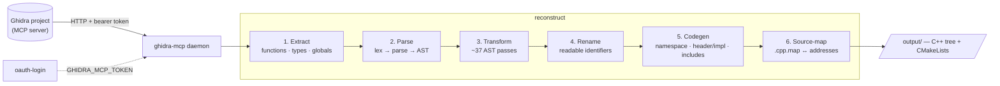

# ghidra-reconstruct

Turn a Ghidra decompilation into a clean, namespaced, **recompilable** C++ source tree.

Ghidra's decompiler produces correct-but-ugly pseudo-C: `CONCAT44`, `undefined4`,
reciprocal-multiply division, rotated loops, raw `*(int *)(p + 0x4c)` field access,
`iVar7`/`uVar3` names, vtable calls as indirect jumps. This tool pulls that output over
the [ghidra-mcp](https://github.com/) daemon, parses it into a real C++ AST, runs a
pipeline of ~37 AST transforms that undo those artifacts, then emits an organized source
tree (per-namespace files, header/impl split, a CMake build, and `.cpp.map` source-maps
back to the original binary addresses).

It is written for a 32-bit MSVC binary but the engine is binary-agnostic.

## Pipeline



- **Extract** (`packages/reconstruct/src/extract`, `connection.ts`): connects to the
  daemon (`GHIDRA_MCP_TOKEN` for OAuth-protected servers), lists functions, batch-decompiles
  them, and pulls data types and globals. A library/CRT detector flags compiler-runtime
  functions so they are skipped rather than reconstructed. Results are cached.
- **Parse** (`packages/cpp-parser`): a hand-written lexer + recursive-descent parser turns
  Ghidra's pseudo-C into a typed AST (it understands Ghidra-isms like `undefined`, `code *`,
  `CONCAT`/`SUB`/`ZEXT`).
- **Transform → Rename → Codegen**: see below.
- **Source-map**: every emitted `.cpp` gets a `.cpp.map` linking each function back to its
  `win`/`mac` binary address, so the cleaned source stays traceable to the original.

## The improvement phases

The transform pipeline (`packages/cpp-parser/src/transform`) is plugin-based. Two presets:
`quick` (artifact removal only) and `full` (everything). Passes, grouped by intent:

**Strip Ghidra artifacts**
- `ghidra-cleanup` — remove the spurious casts Ghidra adds to literals/expressions
- `concat-transform` — `CONCAT44(a,b)` → explicit shift/or (or injected helpers)
- `dead-branch-cleanup` — drop `if(true)`/`if(false)` branches
- `void-return-cleanup` — strip trailing `return;` from void functions
- `boilerplate-cleanup`, `redundant-paren-cleanup`, `redundant-negation` (`x + -y` → `x - y`),
  `nullptr-cleanup`, `boolean-cleanup`

**Recover control flow**
- `loop-canonicalize`, `loop-rotation-undo` — `if(C){do{...}while(C)}` → `while(C){...}`
- `switch-reconstruct` — rebuild switch statements from jump-table dispatch
- `short-circuit-fold` — `if(a){if(b){…}}` → `if(a && b){…}`
- `phi-node-ternary` — SSA phi patterns → ternary
- `dead-branch-cleanup`, `ternary-simplify`

**Idiomatize expressions**
- `increment-simplify` — `x = x + 1` → `x++`, `x = x op y` → `x op= y`
- `magic-division` — reciprocal-multiply sequences → real `/` and `%`
- `sbb-branchless`, `signed-literal`, `fourcc-literal` — `0x636c6163` → `'calc'`
- `pointer-cast-normalize`, `type-normalize`

**Recover memory / struct / call shape**
- `struct-field` — `*(int *)(p + 0x4c)` → `p->field` (uses extracted type layouts)
- `array-access`, `bitfield-access`
- `method-call-rewrite`, `vtable-calls`, `indirect-call-cleanup`, `func-ptr-literal`
- `memory-patterns`

**Tidy declarations**
- `decl-init-merge` — merge a bare decl with its first assignment
- `decl-order-fix` — reorder so initializer dependencies hold
- `decl-scope-sink` — sink a decl into the one scope that uses it

**Domain-specific**
- `prng-transform` + `prng-temp-collapse` — collapse inlined LCG/PRNG expressions
  into `D2_SEED_NEXT(...)` macro calls

After transforms, a **rename** pass replaces Ghidra's `iVar`/`uVar`/`pDVar` names with
readable identifiers, and **codegen** organizes the result (`--organization namespace|flat|module`),
splits headers from implementations, and resolves `#include`s via an injection collector that
also emits any helper macros/typedefs the transforms introduced.

## Layout

- `packages/cpp-parser` — the C++ lexer/parser/AST/emitter and the transform plugins
- `packages/reconstruct` — extraction, daemon connection, codegen, module graph, CLI
- `packages/shared` — shared types/utilities

## Usage

```bash
npm install

# 1. Authenticate to an OAuth-protected daemon (writes a token file)
node oauth-login.mjs            # then export the printed token:
export GHIDRA_MCP_TOKEN=...     # not needed for an unauthenticated/local daemon

# 2. Reconstruct (daemon defaults to http://localhost:8432)
npx reconstruct \
  --project "ghidra://<host>:<port>/<ProjectName>" \
  --out ./output \
  --organization namespace \
  --transform-preset full
```

Output is a CMake project:

```bash
cd output && mkdir build && cd build && cmake .. && cmake --build .
```

## Status / caveats

Reconstructed code is a starting point, not a drop-in rebuild. Known gaps: some struct
field layouts must be present in the source Ghidra DB for `struct-field` to fully resolve;
custom/register calling conventions may need manual confirmation; CRT/RTTI internals are
excluded and provided by the real runtime.
