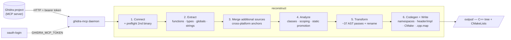

# ghidra-reconstruct

Turn a Ghidra decompilation into a clean, namespaced, **recompilable** C++ source tree.

Ghidra's decompiler produces correct-but-ugly pseudo-C: `CONCAT44`, `undefined4`,
reciprocal-multiply division, rotated loops, raw `*(int *)(p + 0x4c)` field access,
`iVar7`/`uVar3` names, vtable calls as indirect jumps, goto-heavy control flow. This is a
TypeScript pipeline that pulls that output over the [ghidra-mcp](https://github.com/)
daemon, parses it into a real C++ AST, runs a suite of ~37 AST transform passes that undo
those artifacts, optionally merges a second binary (e.g. a Mac build) to attach
cross-platform address anchors, then emits an organized source tree (per-namespace files,
header/impl split, a CMake build, and `.cpp.map` source-maps back to the original binary
addresses).

It was written against a 32-bit MSVC binary (Diablo II `Game.exe`) but the engine is
binary-agnostic.

---

## How it works



The `reconstruct()` entry point (`packages/reconstruct/src/index.ts`) runs these phases:

1. **Connect** — open a session to the daemon for the primary program
   (`GHIDRA_MCP_TOKEN` for OAuth-protected servers). If `additionalSources` are configured,
   they are **preflighted here**: each secondary binary is opened *before* the expensive
   primary extraction and held warm, so a missing/unopenable source fails fast instead of
   silently emitting win-only output, and the later merge reuses the warm session instead
   of re-analyzing the binary (which would OOM the shared Ghidra worker).
2. **Extract** (`extract/`, `connection.ts`) — list functions, batch-decompile them, pull
   data types, globals, strings, and namespaces. A CRT/MSVC library detector flags
   compiler-runtime functions so they are skipped rather than reconstructed. Results are
   cached (`cache.ts`).
3. **Merge additional sources** — for each configured secondary binary, extract its named
   functions/globals/types and fold them into the primary extraction. Functions present in
   both are annotated with a `crossPlatformAddress` (no body duplication); functions unique
   to the secondary are tagged with an `#ifdef` and appended. Matching is by qualified name,
   then unique bare name, then `crossPlatformLinks`. The warm preflight connections are then
   released.
4. **Analyze** (`analysis/`) — detect classes, run scoping analysis, build the call graph,
   compute static-global promotion. Data types are de-duplicated and exclude-pattern filtered.
5. **Transform + Rename** (`packages/cpp-parser`) — the decompiled body of each function is
   lexed and parsed into a typed C++ AST (the parser understands Ghidra-isms like
   `undefined`, `code *`, `CONCAT`/`SUB`/`ZEXT`), then run through the ordered plugin
   pipeline (below). A rename pass replaces `iVar`/`uVar`/`pDVar` with readable identifiers.
6. **Codegen + Write** (`codegen/`) — organize by namespace, split headers from
   implementations, resolve `#include`s (an injection collector also emits any helper
   macros/typedefs the transforms introduced), emit CMake and `.cpp.map` source-maps, write
   to `output/`.

---

## Transform passes

The transform pipeline (`packages/cpp-parser/src/transform`) is plugin-based; the ordered
list with priorities lives in `plugins/index.ts` (`allBuiltinPlugins`). Roughly:
artifact stripping → expression idiomatization → control-flow recovery → declaration
tidying → memory/struct/call shape → pattern detection. Each plugin has a priority and the
list executes in a deterministic order. Two presets exist: `quick` (artifact removal only)
and `full` (everything).

| Pass | What it does |
|-|-|
| `indirect-call-cleanup` | strip jumptable warnings, clean fn-ptr casts (prio 5) |
| `ghidra-cleanup` | remove spurious literal/expr casts, clean names, simplify pointer arith |
| `type-normalize` | `uint` → `uint32_t`, `undefined4` → `auto`/`uint32_t` |
| `pointer-cast-normalize` | `(int)&expr` → `(uintptr_t)&expr` |
| `concat-transform` | `CONCAT31(a,b)` → `(a << 8) \| b` |
| `fourcc-literal` | `(char[4])L'\x...'` → `'abcd'` |
| `method-call-rewrite` | flat fn call → C++ method call (off by default) |
| `nullptr-cleanup` | `(Type*)0x0` → `nullptr` |
| `signed-literal` | `0xffffffff` → `-1` |
| `increment-simplify` | `x = x + 1` → `x++`, `x = x op y` → `x op= y` |
| `redundant-negation` | `x + -y` → `x - y` |
| `bitfield-access` | `field_0xD & 2` → named bitfield member |
| `sbb-branchless` | `-(uint32_t)(cond) & addr` → `cond ? addr : nullptr` |
| `branchless-select` | `(cond - 1 & mask) + off` → ternary |
| `goto-cleanup` | CFG-based goto → structured if/else/break/loop |
| `redundant-paren-cleanup` | `if((x))` → `if(x)` |
| `loop-rotation-undo` | `if(C){do{...}while(C)}` → `while(C){...}` |
| `short-circuit-fold` | `if(a){if(b){…}}` → `if(a && b){…}` |
| `dead-branch-cleanup` | drop `if(true)`/`if(false)` branches |
| `decl-init-merge` | `int x; x = e;` → `int x = e;` |
| `decl-order-fix` | reorder merged decls so initializer deps hold |
| `decl-scope-sink` | sink a decl into the one scope that uses it |
| `phi-node-ternary` | SSA phi merge → ternary init |
| `boilerplate-cleanup` | strip security cookies, simplify `ERROR` asserts |
| `vtable-calls` | indirect vtable dispatch → `this->vmethod_N(...)` |
| `switch-reconstruct` | if-else-if chain → `switch` |
| `magic-division` | reciprocal-multiply → real `/` and `%` |
| `loop-canonicalize` | normalize loop increment/decrement forms |
| `array-access` | pointer-index patterns → `arr[i]` |
| `struct-field` | `*(int *)(p + 0x4c)` → `p->field_4c` |
| `boolean-cleanup` | `expr != false` → `expr` |
| `ternary-simplify` | `(x != 0) ? 1 : 0` → `x != 0` |
| `func-ptr-literal` | `0x5011f0` → `FunctionName` |
| `prng-transform` | LCG seed expr → `D2_SEED_NEXT(...)` |
| `prng-temp-collapse` | collapse inlined PRNG temp vars |
| `void-return-cleanup` | strip trailing `return;` in void fns |
| `memory-patterns` | late memory-shape pattern detection |

### Illustrative before → after

**`sbb-branchless`** — x86 `SBB reg,reg` + `AND reg,addr` selects a value or zero:

```c
// before
-(uint32_t)(condition) & function_address
// after
condition ? function_address : nullptr
```

**`branchless-select`** — the dual idiom, `(cond - 1) & mask`:

```c
// before
((0x14 < n) - 1 & -21) + 0x14
// after
0x14 < n ? 0x14 : -1
```

**`magic-division`** — multiply-shift back to division:

```c
(x * 0xAAAAAAAB) >> 33    →  x / 3
(x * 0xCCCCCCCD) >> 34    →  x / 5
(x * 0x92492493) >> 34    →  x / 7
```

**`ternary-simplify`**:

```c
(x != 0) ? 1 : 0     →  x != 0
(x) ? false : true   →  !x
!(x < y)             →  x >= y
x == false           →  !x
```

**`phi-node-ternary`** — SSA phi merge lowered to C89, restored to an init:

```c
// before
int x; if (c) { x = a; } else { x = b; }
// after
int x = c ? a : b;
```

**`struct-field`** — raw offset deref to arrow access (uses extracted type layouts):

```c
// before
*(int *)(param_1 + 4)
// after
param_1->field_4      // or ((StructType*)param_1)->field_4
```

**`bitfield-access`** — byte-mask ops back to named bitfield members (needs a catalog):

```c
expr->field_0xD & 2     →  expr->interact       // read test
expr->field_0xD |= 2    →  expr->interact = 1   // set bit
expr->field_0xD &= ~2   →  expr->interact = 0   // clear bit
```

**`switch-reconstruct`** — if-else-if chain on one variable to a `switch`:

```c
// before
if (x == 1) { body1; }
else if (x == 2) { body2; }
else { default_body; }
// after
switch (x) {
  case 1: body1; break;
  case 2: body2; break;
  default: default_body;
}
```

**`increment-simplify`**:

```c
x = x + 1    →  x++
x = x - n    →  x -= n
x = x << n   →  x <<= n
```

**`loop-canonicalize`** + **`loop-rotation-undo`**:

```c
i = i + 1                       →  i++
if (C) { do { ... } while (C) } →  while (C) { ... }
```

**`goto-cleanup`** — CFG-based de-optimization of Ghidra's goto soup into structured
if/else, `break`, loop conversion, and dead-code elimination (12 patterns: cascading
forward gotos to a shared exit, goto→return, backward goto→loop, switch goto→break,
cross-scope terminal gotos, cleanup-tail inlining, etc.).

**`fourcc-literal`** — 4-byte char codes (common in game item codes) to strings:

```c
(char [4])L'\x20736831'     →  "1hs "    // little-endian decode
(char (*)[4])L'\x20687468'  →  "hth "
```

**`prng-transform`** — Diablo II LCG seed advance to a macro:

```c
// before  (matches  ... * 0x6ac690c5 + ...)
(D2SeedStrc)(obj->nSeedLow * 0x6ac690c5 + ...)
// after
D2_SEED_NEXT(obj->sSeed)     // or D2_SEED_NEXT(*this) / D2_SEED_NEXT_VAL(DVar1)
```

**`nullptr-cleanup`**:

```c
(Type*)0x0       →  nullptr
&DAT_00000000    →  nullptr
_DAT_000000NN    →  *(int32_t*)0xNN   // small-address null+offset deref
```

**`signed-literal`**:

```c
0xffffffff           →  -1   (32-bit)
0x80000000           →  INT32_MIN
0xffffffffffffffff   →  -1   (64-bit)
```

**`vtable-calls`** — indirect vtable dispatch to a readable method call:

```c
// before
(**(code **)(*this + 0x10))(this, param_1)
// after
this->vmethod_10(param_1)
```

**`method-call-rewrite`** (opt-in) — flat C functions identified as class methods become
real method calls; inside a converted method, the this-param and same-class calls collapse:

```c
DRLG_Init(pDrlg, nAct)  →  pDrlg->Init(nAct)     // call site
pDrlg->nAct             →  this->nAct            // body (this-param)
DRLG_Alloc(pDrlg, x)    →  this->Alloc(x)        // same-class call
this->member            →  member                // strip redundant this->
```

---

## Cross-platform anchoring

A second binary (e.g. a Mac build of the same program) can be merged to attach
cross-platform address anchors. Configure it under `additionalSources` in `project.json`:

```jsonc
{
  "additionalSources": [
    {
      "ghidra": "ghidra://HOST:PORT/ProjectName",
      "programPath": "/macos/1.14d/DiabloII_macho",
      "platform": "mac"
    }
  ]
}
```

During the merge phase:

- A function present in **both** binaries (matched by qualified name, then unique bare name)
  is annotated with the secondary's address. Codegen emits an anchor comment so the cleaned
  source stays traceable to *both* originals:

  ```cpp
  // 1.14d win: 0x6FAB1230 | mac: 0x00412AB0
  void D2DrlgStrc::Init(int nAct) { ... }
  ```

- A function unique to the secondary is tagged with an `#ifdef` (default
  `D2_PLATFORM_<PLATFORM>`, overridable via `ifdef`) and appended to the tree.

When two functions are the *same* code but have *different names/addresses* (so name/bare
matching can't link them — e.g. via Ghidra Version Tracking), supply explicit
`crossPlatformLinks` (typically populated by a `sync-names` tool):

```jsonc
{
  "crossPlatformLinks": [
    { "win": "0x6FAB1230", "mac": "0x00412AB0" }
  ]
}
```

The merge resolves a secondary function's address through these links to its primary
counterpart and anchors it accordingly. If a configured source can't be opened, the run
aborts (fail-fast) rather than emitting output missing its `mac:` anchors.

---

## Usage

```bash
npm install
```

The generic runner is `run.ts` (re-execs itself with `--stack-size=8192` for deeply nested
function ASTs). It is driven entirely by environment variables:

| Env var | Meaning | Default |
|-|-|-|
| `GHIDRA_PROJECT_PATH` | primary project URL, e.g. `ghidra://HOST:PORT/ProjectName` | **required** |
| `GHIDRA_DAEMON_URL` | ghidra-mcp daemon URL (set when not on localhost) | `http://localhost:8432` |
| `GHIDRA_MCP_TOKEN` | bearer token for an OAuth-protected daemon | **required** |
| `GHIDRA_PROGRAM_PATH` | program within a multi-program `.gpr` | `/Game.exe` |
| `GHIDRA_PROJECT_NAME` | name stamped into the generated project | `Reconstructed` |

```bash
# 1. Authenticate to an OAuth-protected daemon, then export the printed token
node oauth-login.mjs
export GHIDRA_MCP_TOKEN=...        # not needed for an unauthenticated/local daemon

# 2. Run
export GHIDRA_PROJECT_PATH="ghidra://HOST:PORT/ProjectName"
export GHIDRA_DAEMON_URL="http://HOST:PORT"     # if remote
npx tsx run.ts
```

`run.ts` reads `project/project.json`, writes the source tree to `output/`, logs parse
errors to `project/parser-errors.log`, and enables CMake generation, source maps, and
static-global promotion.

---

## Configuration — `project/project.json`

Schema in `packages/reconstruct/src/config/schema.ts`. Key sections:

```jsonc
{
  "version": 1,
  "project": "MyProgram",

  // Group namespaces into modules to drive header dependencies + targets
  "modules": {
    "d2common": { "namespaces": ["D2Common"], "dependencies": ["storm"] },
    "d2game":   { "namespaces": ["D2Game"], "dependencies": ["d2common"] }
  },

  // Force a type into a specific header (otherwise placement is inferred)
  "typeOwnership": [
    { "type": "D2UnitStrc", "header": "d2common/units.h" }
  ],

  // Secondary binaries merged for cross-platform anchors (see above)
  "additionalSources": [
    { "ghidra": "ghidra://HOST:PORT/Proj", "programPath": "/macos/...", "platform": "mac" }
  ],

  // Explicit win<->mac address links for same-code/different-name functions
  "crossPlatformLinks": [
    { "win": "0x6FAB1230", "mac": "0x00412AB0" }
  ]
}
```

- **`modules`** — namespace-prefix → module mapping plus inter-module `dependencies`; drives
  which headers a module may include and how targets are organized.
- **`typeOwnership`** — pins a type to a specific output header instead of letting placement
  be inferred from usage.
- **`additionalSources`** — secondary Ghidra projects to merge (cross-platform anchoring).
- **`crossPlatformLinks`** — pre-computed address pairs to link functions that name/bare
  matching can't.

Other supported keys: `overrides` (replace/patch a function body), `libraries` +
`libraryDetection` (map known CRT/lib functions to headers), `targets` (CMake target
shaping by namespace / address-range / type), `methodConversions` / `methodConversionsFile`
and `autoMethodConversion` (flat function → C++ method promotion).

---

## Output layout

```
output/
  <module>/             # per-namespace/module directory
    <name>.h            # declarations (types, prototypes, globals)
    <name>.cpp          # implementations
    <name>.cpp.map      # source-map: each function -> win/mac binary address
  CMakeLists.txt        # top-level build
  <target>/CMakeLists.txt
project/
  project.json
  parser-errors.log
  .ghidra-mcp/buildinfo.json
```

Every emitted `.cpp` gets a `.cpp.map` linking each function back to its `win`/`mac` binary
address, so the cleaned source stays traceable to the original. Organization is selectable
(`namespace` | `flat` | `module`).

---

## Building

The output is a CMake project:

```bash
cd output && mkdir build && cd build && cmake .. && cmake --build .
```

## Layout (this repo)

- `packages/cpp-parser` — the C++ lexer/parser/AST/emitter and the transform plugins
- `packages/reconstruct` — extraction, daemon connection, analysis, codegen, module graph
- `packages/shared` — shared types/utilities
- `run.ts` — generic env-driven runner

## Status / caveats

Reconstructed code is a starting point, not a drop-in rebuild. Known gaps: some struct
field layouts must be present in the source Ghidra DB for `struct-field` to fully resolve;
`bitfield-access` needs a bitfield catalog; custom/register calling conventions may need
manual confirmation; CRT/RTTI internals are excluded and provided by the real runtime.
`method-call-rewrite` is opt-in.
